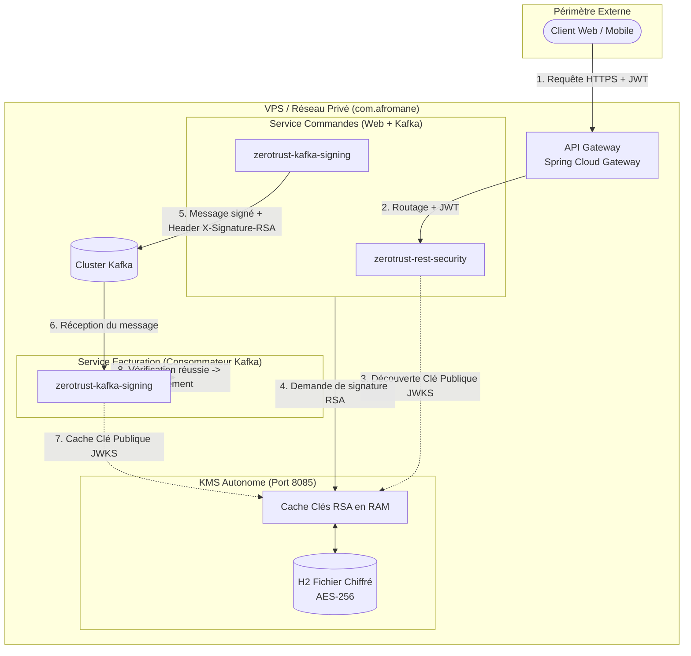

# Architecture Zero Trust & Cryptographie Asymétrique (RSA)

Ce document décrit en détail l'architecture, les flux de données et les principes de sécurité de la plateforme **Zero Trust** développée pour le groupe **`com.afromane`**.

---

## 1. Principes Fondamentaux de Sécurité (Zero Trust)

L'architecture repose sur quatre piliers stricts :

1. **Ne faire confiance à aucun réseau (*Never Trust the Network*) :**
   Même sur un réseau privé interne ou sur une machine virtuelle unique (VPS), aucun microservice ne fait confiance aveuglément aux requêtes entrantes. Chaque flux est authentifié et vérifié.

2. **Validation stricte à chaque saut (*Verify Explicitly*) :**
   L'API Gateway en bordure ne suffit pas. Chaque microservice métier agit comme un serveur de ressources autonome (*Resource Server*) qui valide mathématiquement la signature RSA du jeton JWT, sa date d'expiration et son émetteur.

3. **Prévention du rejeu de jetons (*Audience Restriction*) :**
   Un jeton d'accès légitime émis pour le service `orders-service` contient le claim `aud: ["orders-service"]`. Si un attaquant tente de réutiliser ce même jeton pour appeler directement `billing-service`, la dépendance `zerotrust-rest-security` le rejette automatiquement.

4. **Intégrité et non-répudiation des messages asynchrones (*Payload Integrity*) :**
   Les messages publiés dans les topics Kafka sont signés numériquement par le microservice émetteur avec sa clé privée RSA. Le récepteur vérifie la signature avec la clé publique avant d'exécuter la moindre logique métier.

---

## 2. Schéma Global des Flux

---

## 3. Le Microservice KMS (`kms-service`)

### Persistance et Sécurité sur VPS (H2 Chiffré AES-256)
* **Emplacement du fichier :** `./data/kms_encrypted_db.mv.db`
* **Algorithme de chiffrement :** AES-256 au niveau fichier.
* **Mot de passe maître :** Injecté au lancement via la variable d'environnement `KMS_MASTER_KEY`.
* **Cycle de vie de la clé RSA :**
  1. *Premier démarrage :* Détection de l'absence de clé -> génération automatique d'une paire RSA 2048 bits -> chiffrement dans H2 -> chargement en RAM.
  2. *Redémarrage du VPS :* Déverrouillage de H2 avec `KMS_MASTER_KEY` -> chargement en RAM de la clé existante. **Aucun utilisateur n'est déconnecté et les anciens messages Kafka restent valides.**
  3. *En fonctionnement :* Toutes les opérations cryptographiques sont servies depuis la mémoire vive (RAM), sans latence disque.

### API REST exposées par le KMS
| Méthode | Endpoint | Rôle |
| :--- | :--- | :--- |
| `GET` | `/.well-known/jwks.json` | Expose les clés publiques au format standard RFC 7517 (JWKS). |
| `POST` | `/api/v1/kms/sign` | Signe un payload Base64 avec la clé privée active et renvoie la signature RSA. |
| `POST` | `/api/v1/kms/verify` | Vérifie la validité d'une signature RSA. |
| `GET` | `/api/v1/kms/active-key-id` | Renvoie l'identifiant de la clé RSA actuellement active. |

---

## 4. Dépendance 1 : `zerotrust-rest-security`

### Responsabilités
* Active automatiquement Spring Security en mode **Stateless** (aucun cookie de session, protection CSRF désactivée car stateless).
* Configure le décodeur `NimbusJwtDecoder` branché sur le point de terminaison JWKS du KMS.
* Injecte le validateur `AudienceValidator` pour s'assurer que le jeton reçu était bien destiné à ce microservice spécifique.
* Fournit le composant `TokenRelayInterceptor` pour propager l'en-tête `Authorization: Bearer <token>` lors des appels HTTP sortants via `RestClient` ou `RestTemplate`.

### Propriétés de configuration (`application.yml`)
| Propriété | Type | Défaut | Description |
| :--- | :--- | :--- | :--- |
| `zerotrust.rest.enabled` | boolean | `true` | Active ou désactive le starter. |
| `zerotrust.rest.jwk-set-uri` | string | `http://localhost:8085/.well-known/jwks.json` | URL du JWKS pour récupérer les clés publiques. |
| `zerotrust.rest.audience` | string | *(optionnel)* | Nom de l'audience attendue dans le claim `aud`. |
| `zerotrust.rest.permitted-paths` | list | `["/actuator/health", "/actuator/info", "/error"]` | Chemins publics sans authentification. |

---

## 5. Dépendance 2 : `zerotrust-kafka-signing`

### Responsabilités
* **Côté Producteur (`KafkaMessageSigner`) :**
  * Intercepte l'événement à publier.
  * Contacte le KMS pour obtenir la signature RSA du payload.
  * Injecte la signature dans l'en-tête Kafka `X-Signature-RSA` et l'identifiant de clé dans `X-Key-Id`.
* **Côté Consommateur (`KafkaSignatureVerificationInterceptor`) :**
  * Intercepteur automatique branché sur tous les conteneurs `@KafkaListener`.
  * Télécharge et met en cache en mémoire vive la clé publique RSA depuis le JWKS du KMS.
  * Vérifie mathématiquement la signature de chaque message reçu.
  * **Rejet immédiat :** Si la signature est manquante ou si le payload a été altéré, le message est rejeté avec une `SecurityException` avant d'atteindre la méthode `@KafkaListener`.

### Propriétés de configuration (`application.yml`)
| Propriété | Type | Défaut | Description |
| :--- | :--- | :--- | :--- |
| `zerotrust.kafka.enabled` | boolean | `true` | Active ou désactive la sécurité Kafka. |
| `zerotrust.kafka.kms-base-url` | string | `http://localhost:8085` | URL de base du microservice KMS. |
| `zerotrust.kafka.signing-enabled` | boolean | `true` | Active la signature automatique à l'envoi. |
| `zerotrust.kafka.verification-enabled` | boolean | `true` | Active la vérification automatique à la réception. |
| `zerotrust.kafka.signature-header-name`| string | `X-Signature-RSA` | Nom de l'en-tête Kafka transportant la signature. |
| `zerotrust.kafka.key-id-header-name` | string | `X-Key-Id` | Nom de l'en-tête Kafka transportant le keyId. |
